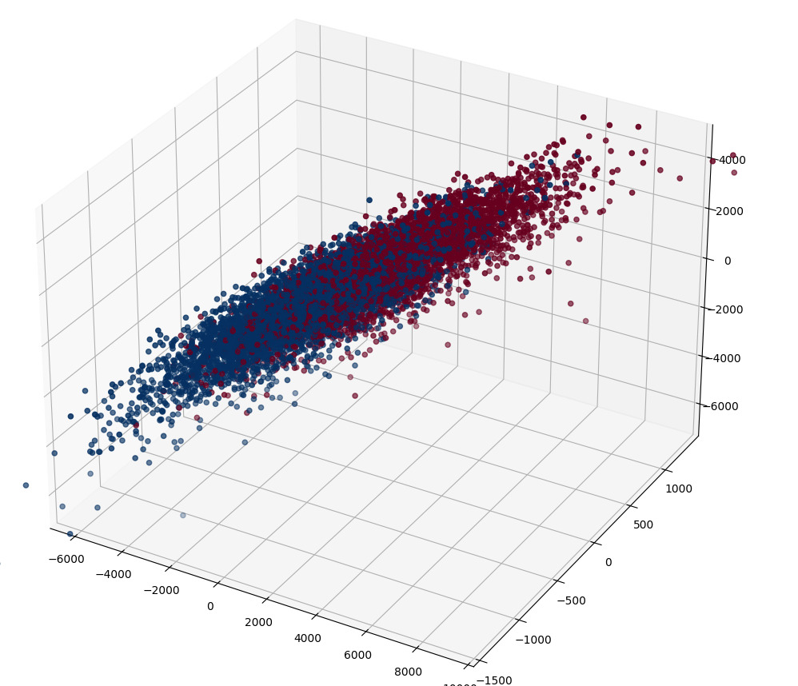
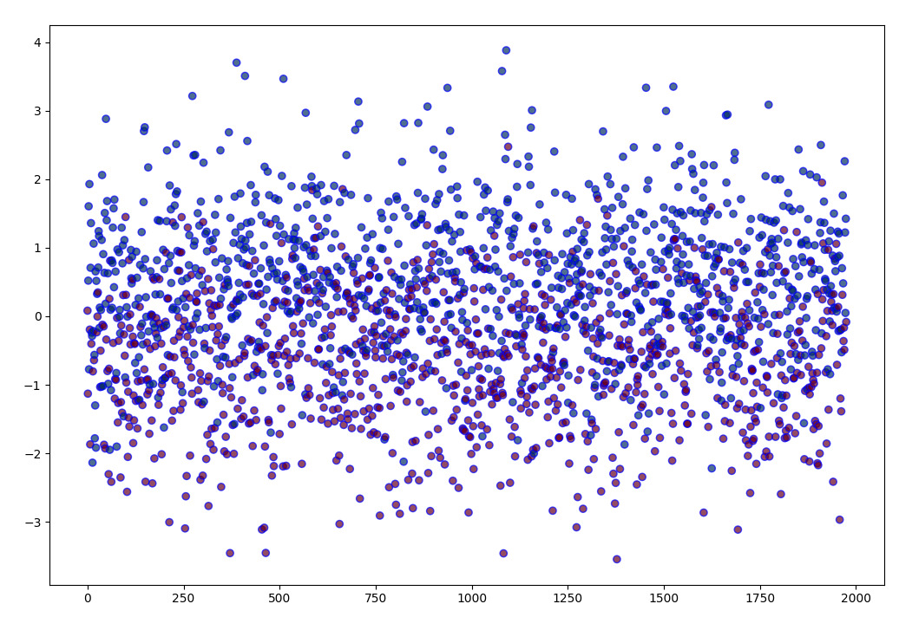

# Analiza Meciurilor de League of Legends

## Introducere în tema abordată

League of Legends (LoL) este un joc de strategie în echipă, foarte popular în genul multiplayer online battle arena (MOBA). Jucătorii controlează campioni unici cu abilități speciale și lucrează împreună pentru a distruge baza adversarilor. Este cunoscut pentru complexitatea și dinamismul său, atrăgând milioane de jucători din întreaga lume.

### Natura Strategică a Jocului

League of Legends necesită o coordonare constantă și strategie între membrii echipei. Iată câteva aspecte strategice:

- Controlul Viziunii: Într-o hartă acoperită de ”Fog of war”, unde viziunea este limitată plasarea și distrugerea ward-urilor sunt cruciale pentru a obține informații despre mișcările inamicului și a evita ambuscadele.
- Sinergia Echipei: Compoziția echipei și modul în care abilitățile campionilor interacționează sunt esențiale pentru succes în luptele de echipă.
- Rotirea pe Hartă: Mobilitatea și rotirea eficientă a membrilor echipei între diferite linii și obiective pot asigura dominarea pe hartă.
- Gestionarea Resurselor: Echilibrul între colectarea resurselor (minioni, monștri neutri) și participarea la lupte și obiective este cheia pentru maximizarea avantajului.

Prin analizarea și gestionarea eficientă a acestor obiective și strategii, echipele pot obține avantaje semnificative și în cele din urmă să câștige meciurile.

Jocul a avut o influență semnificativă în streaming, media și esports, contribuind la popularizarea acestor domenii. Este unul dintre cele mai populare jocuri pentru streaming, atrăgând milioane de spectatori pe platforme precum Twitch și YouTube. În media, LoL a inspirat scurtmetraje, seriale și muzică, inclusiv celebrul serial de animație Arcane, de pe Netflix, care este aclamat de critici și amatori deopotriva, serial inspirat din universul poveștii League of Legends. În esports, LoL este un pilon principal, cu ligi profesionale și turnee globale care atrag milioane de spectatori și oferă premii mari.

Motivul pentru care am ales acest studiu este în principal pasiunea, majoritatea echipei noastre fiind jucători cu experiență și un profund interes/miză în rezultatul cercetării: cum putem câștiga mai multe meciuri? Pe ce elemente ale jocului trebuie să ne concentrăm la început?

## Date Analizate

Pentru acest studiu de caz am folosit date despre 10.000 de meciuri de rang înalt (Diamond 1 – Master) preluate de pe site-ul de cercetare Kaggle, dintr-o colecție de date  publicate în anul 2020, ce conține 40 de variabile vizând performața echipelor.

### Variabile

Din acești 40 de indicatori de performanță, am ales următoarele variabile bazate pe relevanța lor, în urma unor grupări:

- Câștigul echipei, pe care dorim să îl prezicem, ce fluctuează în urma unor evenimente adesea imprevizibile, bazat pe faza de început a meciului
- Numărul de ”Wards” puși, un element esențial al jocului ce oferă viziune asupra harții și previne ambuscade ori capcane, face diferența în momente cheie
- Numărul de „Wards” distruse, așa cum am menționat anterior, acestea sunt un obiect cheie, iar eliminarea lor reduce influența echipei adevrsare, atât direct cât și indirect, psihologic fiind mai precauți
- „First Blood”, adevăratul start al meciului, cu potențialul de a evolua ca un „Butterfly effect” în ambele direcții, oferă un avantaj semnificativ în bani
- Numărul de omoruri, cel mai ușor de observat element într-un meci, cu puternice implicații – pentru o perioada de timp un jucător este absent, oferind avantaj numeric adversarilor, dar și bani, care oferă avantaje
- Numărul de morți, un dezavantaj care mai presus de tot, afectează moraul și psihicul jucătorului, nu doar utilitatea directă,  a sa
- Numărul de asist-uri,  denotă adesea o echipă unită, care luptă împreună
- Dragoni omorâți, unul din cei mai importanți factori,ce oferă avantaje atât individual, cât și unul major primei echipe care omoară 4
- Herald, un monstru ce apare în prima parte a meciului, este un obiectiv important pentru a scădea teritoriul inamic
- Turnuri distruse, împingerea adversarului în spate îi reduce influența asupra hărții, îi limitează accesul la resurse și e singura cale către adevăratul obiectiv: Nexus
- Aurul total câștigat, util pentru a cumpăra obiecte, principalul factor care face jucătorii mai puternici, cu efecte esențiale în lupte
- Experiența totală câștigată, un avantaj atât în numere, cât și în deblocarea unor noi abilități
- Totalul minionilor uciși, principalul factor care oferă aur și experiență pe ”Lanes”
- Totalul monștrilor din junglă uciși, principala sursă de aur și experiența pentru roul de ”Jungle”

## Analiza

### Metode

Pentru studiul nostru, am utilizat metodele:

- EFA
- PCA
- LDA

Motivul utilizării acestor metode a fost reducerea setului de date la o serie „curated” de date, mai ușor de analizat și concretizat în rezultate palpabile ce pot fi utilizate atât de noi, cât și de alți jucători.

### EFA

Pentru a verifica dacă stul de date poate fi descompus în factori utilizând testul Barlett și KMO:

- Chi-Square: 100344.13936921376
- P-Value: 0.0
- Indice KMO 0.7430786689332358

#### Test Barlett

Ipoteze test Barlett:

- H0 – Nu există factoriabilitate
- H1 – Există factoriabilitate

Pentru un grad de încredere de 95%, îl comparăm pe P-Value cu 0.05(1- 0.95). Deoarece p-value < 0.05 => Respingem H0 și acceptăm H1 => Putem realiza analiza pe factori pentru setul curent de date.
Testul KMO arată gradul de factoriabilitate al setului de date. Indicele KMO este de 0.74, fiind mai mare decât 0.5, sugerează un grad ridicat de factoriabilitate.

#### Interpretarea factorilor

Variația Cumulativă:

- F1:0.25679638
- F2:0.50316009
- F3:0.6136992
- F4:0.72289598

Factorii aleși explică 72% din variația setului de date.

Inițial, setul de date avea 9 factori semnificativi, însă pentru a reduce setul, am eliminat urmatoarele variabile : Numărul de ward uri plasate/distruse, Numărul de heralzi omorâți , Numărul de Turnuri Distruse și Monștrii din junglă ucisi deoarece aveau nivelul de comunalitate sub 60%.

Aceste atribute nu caracterizează faza de început a jocului, ci mai degrabă caracterizează faza intermediară și cea finală, rezultând în nivelului scăzut al comunalității.

#### Tabel Factori

| Metric                  | F1        | F2        | F3        | F4        |
|-------------------------|-----------|-----------|-----------|-----------|
| blueKills               | 0.043017  | 0.906926  | -0.261644 | -0.123772 |
| blueAssists             | 0.056445  | 0.721917  | -0.249674 | -0.141132 |
| blueDragons             | -0.114361 | 0.096709  | -0.006599 | -0.796791 |
| blueTotalGold           | -0.218752 | 0.965588  | -0.115100 | -0.083589 |
| blueTotalExperience     | -0.627768 | 0.592471  | 0.206884  | -0.054007 |
| blueTotalMinionsKilled  | -0.598327 | 0.139285  | 0.184517  | 0.008202  |
| redKills                | 0.915825  | 0.069884  | 0.217429  | 0.121480  |
| redAssists              | 0.752601  | 0.055283  | 0.112354  | 0.122838  |
| redDragons              | 0.070193  | -0.116158 | 0.073802  | 0.761725  |
| redTotalGold            | 0.860860  | -0.068742 | 0.495496  | 0.099137  |
| redTotalExperience      | 0.331785  | -0.336039 | 0.735682  | 0.101117  |
| redTotalMinionsKilled   | -0.047637 | -0.401833 | 0.503434  | 0.012377  |

Deoarece observăm o corelație puternic pozitivă între indicatorii de performanță ai echipei roșii și F1, dar și o corelație puternic negativă cu indicatorii de performanță ai echipei albastre, putem deduce faptul ca F1 reprezintă  „Performanța generală și experiența echipei roșii”.

Ca în oglindă, F2 este influențat pozitiv de indicatorii de performanță ai echipei albastre și negativ de performanța echipei roșii. Deducem astfel că F2 reprezintă „Performanța generală și experiența echipei albastre”.

F3 este corelat în mod principal de Gold, Experience și Minions Killed, toți factori ai Lane Domninance, și mai ales a dominaței echipei roșii, care este corelată în mod poztiv cu acest factor numit  „Lane dominance”.

F4 reprezintă impactul obiectivelor neutre și avantajele lor asupra meciului, în special al Dragonului, care vine adesea și cu o luptă pentru el, rezultând în cateva omoruri și aur distribuit.

Conform unui studiu din 2016, și refăcut în 2024, echipa care ia primul dragon în sub 10 minute are 70% șanse de victorie, însă studiul nostru indică o șansă de doar 63%. Acest lucru indică modificări asupra valorii acestor obiective în urma patch-urilor și schimbărilor aduse jocului, un factor ce poate arăta în ce direcție se dorește evoluția jocului și elementelor importante lui.

Factorii reușesc să separe datele pe baza probabiltăților de câștig în mod seminificativ, așa cum reiese din graficele factorilor.( mai jos exemplu Scatter Plot între factorii F1, F3 și F4):

### PCA

#### Rezultate PCA

Variatie componente:

- PC1: 0.6187376281872501
- PC2: 0.2319184880171962
- PC3: 0.11699681576026214

Varianța Cumulativă:

- O componentă: 0.6187376281872501
- Două Componente: 0.8506561162
- Trei Componente: 0.96765293196

#### Tabel componente

Pentru a păstra cât mai mult din varianța setului de date legată de factorii descoperiți și a permite vizualizara datelor, vom alege 3 dintre cele 23 de componente principale astfel:

| Metric                        | PC1        | PC2          | PC3        |
|--------------------------------|------------|--------------|------------|
| blueWardsPlaced                | -0.000177  | 0.0002037997 | 0.000165   |
| blueWardsDestroyed             | -8.1e-05   | -7.60005e-06 | 2.9e-05    |
| blueFirstBlood                 | -7.8e-05   | -1.955875e-07| -4e-06     |
| blueKills                      | -0.000916  | 0.001191152  | -0.001126  |
| blueAssists                    | -0.001     | 0.001273097  | -0.001648  |
| blueDragons                    | -5.2e-05   | -1.756954e-06| 1.1e-05    |
| blueHeralds                    | -3e-05     | 1.213568e-05 | 7e-06      |
| blueTowersDestroyed            | -3.1e-05   | 2.629184e-05 | -4.4e-05   |
| blueTotalGold                  | -0.581323  | 0.624327     | -0.302864  |
| blueTotalExperience            | -0.431165  | 0.2928883    | 0.641007   |
| blueTotalMinionsKilled         | -0.004673  | -0.0001954129| 0.010126   |
| blueTotalJungleMinionsKilled   | -0.000962  | 0.0002938577 | 0.003982   |
| redWardsPlaced                 | 0.000193   | 3.187157e-05 | 0.000581   |
| redWardsDestroyed              | 9.7e-05    | -9.655566e-06| 6.3e-05    |
| redKills                       | 0.00085    | 0.001218177  | -0.001129  |
| redAssists                     | 0.000932   | 0.001307311  | -0.001741  |
| redDragons                     | 5.4e-05    | 1.881303e-06 | 3.1e-05    |
| redHeralds                     | 2.9e-05    | 9.638026e-06 | -1e-06     |
| redTowersDestroyed             | 2.5e-05    | 2.333201e-05 | -3.5e-05   |
| redTotalGold                   | 0.543665   | 0.649429     | -0.3103    |
| redTotalExperience             | 0.4249     | 0.3204178    | 0.633131   |
| redTotalMinionsKilled          | 0.004689   | 1.257185e-05 | 0.009973   |
| redTotalJungleMinionsKilled    | 0.001005   | 0.0005316083 | 0.004024   |

Pentru prima componentă, grupăm situațiile în care una dintre echipe are avantaj asupra celeilalte. PC1 are o corelație puternic pozitivă cu aurul și experiența echipei roșii, și o corelație puternic negativă cu aurul echipei albastre.

Cea de doua componentă, PC2, vizează situația când echipele se află la egalitate, iar viziunea este importantă pentru câștigarea obiectivelor neutre și a înclina balanța.

A treia situație este atunci când cele 2 echipe joacă sigur, meciul e strâns, caz în care cea mai mică greșeală poate sa escaleze într-o victorie pentru cealaltă echipă.

Graficul aferent analizei PCA prezintă separarea datelor în mod dintre victorie și înfrângere, PC1 separând cel mai bine setul de date. PC2 și PC3, nu realizează o separare la fel de bună, deoarece acestea caracterizează situații în care echipele sunt la egalitate.

Aceste rezultate indică imprevizibilitatea majorității meciurilor, adesea momente cheie cauzând reacții în lanț. Nu doar atât, dar putem deduce o stare nesănătoasă a jocului, unde un avantaj în partea de început este adesea incontestabil, pe care echipa în urmă nu îl poate recupera indiferent de efort.

### LDA

Utilizăm LDA pentru a proiecta datele realtiv a o dreaptă/threshold care să împartă cât mai bine clasele (câștigul echipei roșii/ câștigul echipei albastre).

Totuși, din grafic remarcăm o tendință de grupare a datelor în centru, în loc de o segregare clară. Acest lucru indică totuși o stabilitate generală între cele 2 părți, locul de Spawn nefiind un avantaj clar și consistent.

## Modele - Machine Learning

Mai jos se află lista de modele predictive pe baza datelor discutate anterior:

| Used   | Model                    | Accuracy  | BIAS | Precision | Recall   | F1Score  | TruePos | FalsePos | FalseNeg | TrueNeg |
|--------|--------------------------|-----------|------|-----------|----------|----------|---------|----------|----------|---------|
| EFA3D  | SVM                       | 0.726431  | 80   | 0.732507  | 0.715604 | 0.723957 | 2543    | 906      | 986      | 2481    |
| EFA3D  | LogisticRegression        | 0.725419  | 59   | 0.730047  | 0.717623 | 0.723782 | 2529    | 920      | 979      | 2488    |
| EFA3D  | DecisionTreeClassifier    | 0.683343  | 100  | 0.689635  | 0.669743 | 0.679543 | 2404    | 1045     | 1145     | 2322    |
| EFA3D  | RandomForestClassifier    | 0.725564  | 120  | 0.718706  | 0.743582 | 0.730933 | 2440    | 1009     | 889      | 2578    |
| EFA3D  | GaussianNB                | 0.725709  | 59   | 0.730340  | 0.717912 | 0.724073 | 2530    | 919      | 978      | 2489    |
| EFA4D  | SVM                       | 0.726287  | 67   | 0.731471  | 0.717335 | 0.724334 | 2536    | 913      | 980      | 2487    |
| EFA4D  | LogisticRegression        | 0.727154  | 29   | 0.729785  | 0.723680 | 0.726720 | 2520    | 929      | 958      | 2509    |
| EFA4D  | DecisionTreeClassifier    | 0.691729  | 18   | 0.691535  | 0.695125 | 0.693326 | 2374    | 1075     | 1057     | 2410    |
| EFA4D  | RandomForestClassifier    | 0.722527  | 241  | 0.708738  | 0.758004 | 0.732544 | 2369    | 1080     | 839      | 2628    |
| EFA4D  | GaussianNB                | 0.724696  | 30   | 0.727379  | 0.721085 | 0.724218 | 2512    | 937      | 967      | 2500    |
| LDA    | SVM                       | 0.727444  | 103  | 0.735137  | 0.713297 | 0.724052 | 2558    | 891      | 994      | 2473    |
| LDA    | LogisticRegression        | 0.729468  | 41   | 0.732925  | 0.724257 | 0.728565 | 2534    | 915      | 956      | 2511    |
| LDA    | DecisionTreeClassifier    | 0.704453  | 256  | 0.721582  | 0.668301 | 0.693920 | 2555    | 894      | 1150     | 2317    |
| LDA    | RandomForestClassifier    | 0.723973  | 155  | 0.735205  | 0.702336 | 0.718395 | 2572    | 877      | 1032     | 2435    |
| LDA    | GaussianNB                | 0.728745  | 60   | 0.733490  | 0.720796 | 0.727088 | 2541    | 908      | 968      | 2499    |
| PCA2D  | SVM                       | 0.726431  | 96   | 0.733610  | 0.713297 | 0.723311 | 2551    | 898      | 994      | 2473    |
| PCA2D  | LogisticRegression        | 0.725564  | 74   | 0.731211  | 0.715604 | 0.723324 | 2537    | 912      | 986      | 2481    |
| PCA2D  | DecisionTreeClassifier    | 0.686235  | 180  | 0.697292  | 0.661090 | 0.678709 | 2454    | 995      | 1175     | 2292    |
| PCA2D  | RandomForestClassifier    | 0.721371  | 203  | 0.709809  | 0.751370 | 0.729999 | 2384    | 1065     | 862      | 2605    |
| PCA2D  | GaussianNB                | 0.725275  | 106  | 0.733115  | 0.710701 | 0.721734 | 2552    | 897      | 1003     | 2464    |
| PCA3D  | SVM                       | 0.723973  | 65   | 0.728983  | 0.715316 | 0.722085 | 2527    | 922      | 987      | 2480    |
| PCA3D  | LogisticRegression        | 0.725853  | 68   | 0.731097  | 0.716758 | 0.723857 | 2535    | 914      | 982      | 2485    |
| PCA3D  | DecisionTreeClassifier    | 0.675680  | 141  | 0.684005  | 0.656187 | 0.669807 | 2398    | 1051     | 1192     | 2275    |
| PCA3D  | RandomForestClassifier    | 0.720937  | 236  | 0.707534  | 0.755697 | 0.730823 | 2366    | 1083     | 847      | 2620    |
| PCA3D  | GaussianNB                | 0.725853  | 90   | 0.732603  | 0.713585 | 0.722969 | 2546    | 903      | 993      | 2474    |

Ordonăm modelele după acuratețea și bias-ul lor:

| Used   | Model                    | Accuracy     | BIAS |
|--------|--------------------------|--------------|------|
| LDA    | LogisticRegression       | 0.729467901  | 41   |
| LDA    | GaussianNB               | 0.728744939  | 60   |
| LDA    | SVM                      | 0.727443609  | 103  |
| EFA4D  | LogisticRegression       | 0.727154425  | 29   |
| EFA3D  | SVM                      | 0.726431463  | 80   |
| PCA2D  | SVM                      | 0.726431463  | 96   |
| EFA4D  | SVM                      | 0.726286871  | 67   |
| PCA3D  | LogisticRegression       | 0.725853094  | 68   |
| PCA3D  | GaussianNB               | 0.725853094  | 90   |
| EFA3D  | GaussianNB               | 0.725708502  | 59   |
| PCA2D  | LogisticRegression       | 0.725563910  | 74   |
| EFA3D  | RandomForestClassifier   | 0.725563910  | 120  |
| EFA3D  | LogisticRegression       | 0.725419318  | 59   |
| PCA2D  | GaussianNB               | 0.725274725  | 106  |
| EFA4D  | GaussianNB               | 0.724696356  | 30   |
| PCA3D  | SVM                      | 0.723973395  | 65   |
| LDA    | RandomForestClassifier   | 0.723973395  | 155  |
| EFA4D  | RandomForestClassifier   | 0.722527473  | 241  |
| PCA2D  | RandomForestClassifier   | 0.721370735  | 203  |
| PCA3D  | RandomForestClassifier   | 0.720936958  | 236  |
| LDA    | DecisionTreeClassifier   | 0.704453441  | 256  |
| EFA4D  | DecisionTreeClassifier   | 0.691729323  | 18   |
| PCA2D  | DecisionTreeClassifier   | 0.686234818  | 180  |
| EFA3D  | DecisionTreeClassifier   | 0.683342973  | 100  |
| PCA3D  | DecisionTreeClassifier   | 0.675679584  | 141  |

Deoarece avem de-aface cu variabile binare, ne-am propus să testăm următoarele modele:

- SVM – datorită gradului mare de segregare al setului de date
- DecisionTreeClasifier, RandomForestClassifier – la fel, pentru a segrega cu acuratețe datele
- GaussianNB – deoarece ne așteptăm să aibă performanțe bune pe LDA
- LogisticRegression – deoarece lucrăm cu variabile binare

Conform rezultatelor obținute anterior, ne așteptam ca un model bazat pe SVM sau pe arbori utilizând setul EFA4 să prezică cu cea mai mare acuratețe și bias mic. În mod neașteptat însă, modelul bazat pe LogisticRegression ce folosește LDA oferă cel mai bună combinație (acuratețe, bias). Însă modelele obținute pe baza analizei factorilor oferă cel mai mic bias.

| Used   | Model              | Accuracy     | BIAS |
|--------|--------------------|--------------|------|
| EFA4D  | LogisticRegression | 0.727154425  | 29   |
| EFA4D  | GaussianNB         | 0.724696356  | 30   |
| LDA    | LogisticRegression | 0.729467901  | 41   |

Cele 3 modele reușesc să prezică echipa învingătoare în proporție de peste 72% din cazuri.

Cele 3 modele reușesc să prezică echipa învingătoare în proporție de peste 72% din cazuri.

## Concluzii

În urma datelor, deși jocul este echilibrat în început pentru cele două părți, și este clar balansat pentru echipe de nivel egal, care se află adesea în situatții de egalitate, în mod preponderent un start puternic, în avantaj, adesea dictează finalul meciului,  componenta de revenire din urmă care aduce șarm și tensiune jocului fiind rară. Acest element este recomandat a fi adresat de către dezvoltatori.

Așa cum ne-am propus totuși, folosind modelele de prezicere și analiza factorilor am reușit să simplificăm setul de date , pastrarând în același timp informația utilă. Nu doar asta, dar am reușit alegem un model ce prezice cât mai bine care este echipa câștigatoare pe baza setului de date redus la câteva dimensiuni, oferind informații utile atât pentru noi ca jucători, cât și pentru a paria pe meciuri bazat pe începutul lor – informație valoroasă în piața curentă.

## Biografie

- [League Analysis Factor Analysis vs PCA](https://www.kaggle.com/code/myzziah/league-analysis-factor-analysis-vs-pca/notebook)
- [Odds of winning in League of Legends](https://www.unrankedsmurfs.com/blog/odds-winning-league-legends)
- Software Development for Data Analysis, Vințe Claudiu
